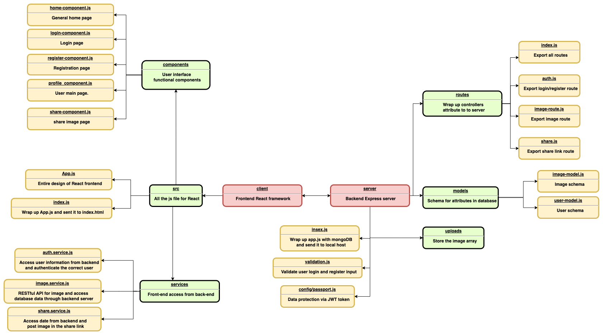

# imageAPI Documentation

<h2>Specification </h2>
<h3>Frontend: React</h3>
<h3>Backend: Express/Node.js</h3>
<h3>Database: Mongodb/Mongoose </h3>
 

<h2>Demo video</h2>

https://drive.google.com/file/d/1RQLIJUaHo-N1WNMhZpxZnU5SM52Ui65n/view?usp=sharing

 

<h2>Initialize Project</h2>
<h3>With Docker</h3>
Open terminal and run the following steps:

(To clean up previous docker image, please run `docker-compose down -v`)

1.  Go to project repository:

    `cd imageAPI`

    Open docker

    `open -a docker`

    Run make file script or use docker command

    `make run-dev`(`docker-compose up`)

    Open browser, go to: http://localhost:3000/

<h3>Without Docker</h3>

1. Edit code in `server/index.js` and change the code as follow.

2. You need to open two terminal, react, nodejs, mongodb need to be installed in advance.

    First terminal:

    `cd imageAPI/server`

    `npm install`

    `npm run start`

    Second terminal:

    `cd imageAPI/client`

    `npm install`

    `npm start`

    Open browser, go to: http://localhost:3000/

 

<h2>Dockerfile</h2>

<h3>Frontend/ Backend image - node:16-slim</h3>

https://github.com/nodejs/docker-node/blob/3f8018043408490439723ed3b71ab5578d69ea70/16/buster-slim/Dockerfile

Database - mongo:4.4-bionic

https://hub.docker.com/layers/amd64/mongo/4.4.0-bionic/images/sha256-ebd31eaac273a9544a33387aa859b0a8676565340a40fc824fa7bda686f462f1?context=explore

 

<h2>Structure Diagram</h2>

